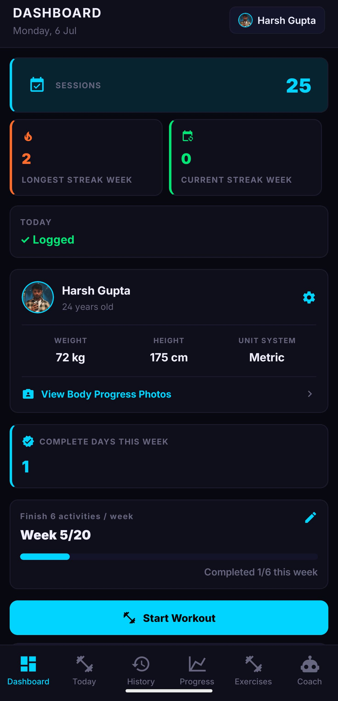
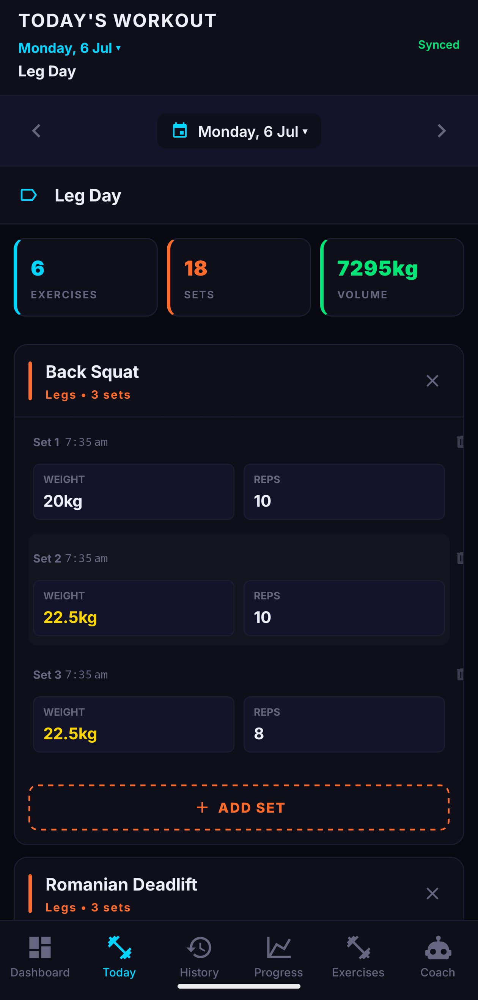
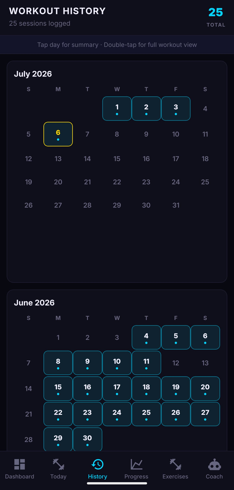
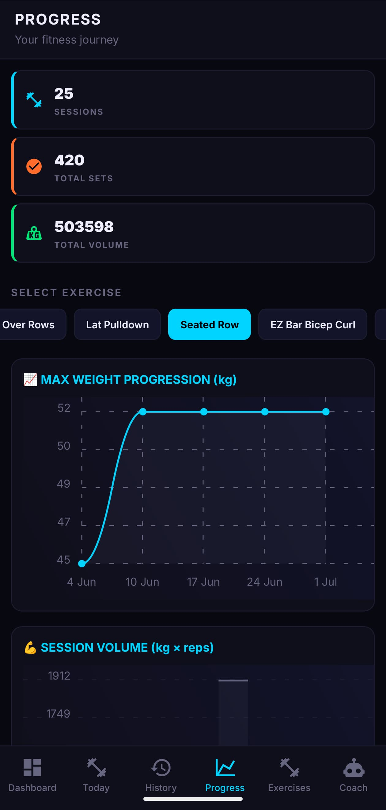
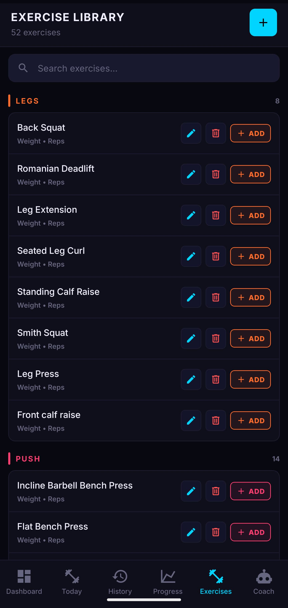
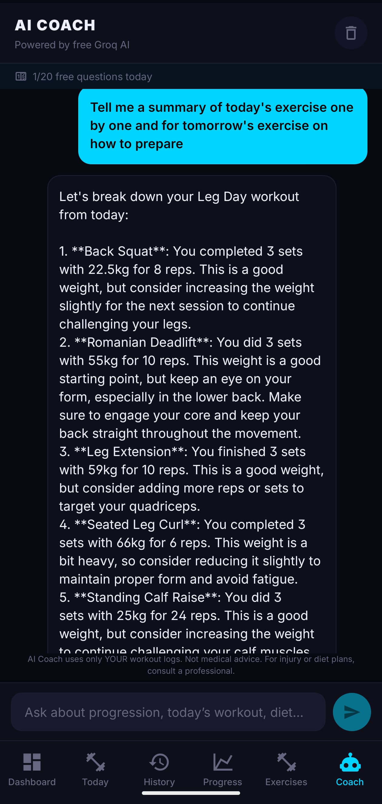

# Gym Tracker

Cross-platform workout tracker built with **React Native (Expo)** — log sets, track progress, sync with **Firebase**, and get tips from a personal **AI Coach** powered by your own training history.

**[Live demo (web)](https://gym-tracker-kdg4.vercel.app)** · **[Download Android APK](https://github.com/HarshGupta-1708/GymTracker/releases/latest)** · **[GitHub](https://github.com/HarshGupta-1708/GymTracker)**

> **Web:** Sign in with Google. **Android:** install APK and use the same Google account — workout history syncs from the cloud.

---

## Screenshots

<p align="center">
  
  
  
  
</p>
<p align="center">
  
  
</p>

---

## Features

| Area | Highlights |
|------|------------|
| **Today** | Log workouts by date, custom exercises & fields, quick-start plans, PR highlights |
| **History** | Calendar of past sessions, full workout view, edit day titles |
| **Progress** | Max weight & volume charts per exercise |
| **Exercises** | 40+ presets, custom exercises, edit/delete with history-aware updates |
| **Dashboard** | Streaks, weekly goals, profile, backup export/import, 6 themes |
| **AI Coach** | RAG-based coach using your logs (Groq API on Render) |
| **Sync** | Firestore cloud sync, offline cache, Google Sign-In |

---

## Architecture (web vs backend)

| Service | Hosts | Role |
|---------|--------|------|
| **Vercel** | Web UI only | Static Expo web app (`npm run build:web` → `dist/`) |
| **Firebase** | Google cloud | Auth + Firestore database (works from web & mobile) |
| **Render** | `coach-api` | AI Coach API (Groq LLM) — already deployed |

**Vercel alone cannot run the full app backend.** Firebase handles login/data; Render handles AI Coach. Both are called from the web app in the browser.

---

## Quick start (developers)

```bash
git clone https://github.com/HarshGupta-1708/GymTracker.git
cd GymTracker
npm install
cp .env.example .env
npm run web
```

---

## Build & deploy

| Target | How |
|--------|-----|
| **Web** | Push to `master` → Vercel auto-builds (see `vercel.json`) |
| **Android APK** | `npm run build:apk` — [docs/APK_BUILD_AND_RELEASE.md](docs/APK_BUILD_AND_RELEASE.md) |
| **AI Coach API** | [docs/COACH_AI_SETUP.md](docs/COACH_AI_SETUP.md) |
| **Web deploy help** | [docs/DEPLOY_WEB.md](docs/DEPLOY_WEB.md) |

---

## Tech stack

Expo 54 · React Native · Firebase · React Navigation · Groq · Render · EAS Build · Vercel

---

## License

Private project — all rights reserved unless otherwise noted.
